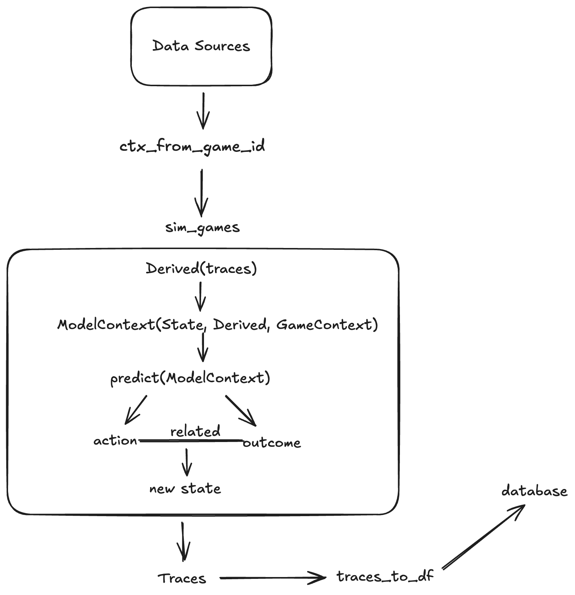
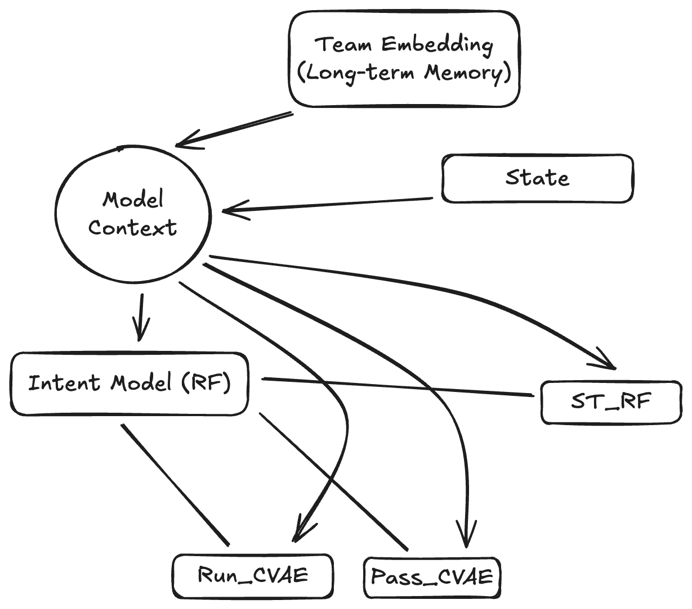

# NFL Game Simulator

A play-by-play NFL game simulation engine.

**The key section of game logic:**
- Trace: All plays up to this point
- State: The state of the game right now
- Game Context: Details about the teams and game.
- Intent: The type of play the team will run.
- Outcome: The outcome of said play.
```{python}
derived = DerivedContext(trace)
context = ModelContext(state, derived, rng, game_context)
intent, outcome = model(context) # Completely abstracted from game logic.
new_state = apply_outcome(state, intent, outcome)
```



**Model Logic:**
1. Features (`ModelContext`):
    1. Long term memory in the form of embeddings are built for each team. They bring these into the game as a whole. These are things like spread, epa, run success, etc.
    2. State of the current game in the form of time, score, yardline, etc.
2. `Intent` model (Random Forest) takes the model context and predicts intent.
3. `ModelContext` and `Intent` is passed to a CVAE per intent. The CVAE produces the play row as an outcome.
    - ST (special teams) model however is a random forest.



The outcome for now is ONLY yards gained, but in the future there will be more.

## Code Style and Conventions

## The Perfect Documentation/Model

This is an example of one of the most perfectly documented piece of inline code I grabbed from online. Seek to emulate this for extremely dense sections or at the developer's request.

```{rust}
let out: ArrayChunked = unsafe {

    // This is similar to apply_values, but it's amortized and made specifically
    // for arrays.
    ca.try_apply_amortized_same_type(|row| {
        let s = row.as_ref();
        // `s` is a Series which contains two elements.
        // We unpack it similarly to the way we've been unpacking Series in the
        // previous chapters:
        //
        // Previously we've been doing this to unpack a column we had behind a
        // Series - this time, inside this closure, the Series contains the two
        // elements composing the "row" (x and y):
        let ca = s.f64()?;

        // There are many ways to extract the x and y coordinates from ca.
        // Here, we remain idiomatic and consistent with what we've been doing
        // in the past - iterate, enumerate and map:
        let out_inner: Float64Chunked = ca
            .iter()
            .enumerate()
            .map(|(idx, opt_val)| {

                // We only use map here because opt_val is an Option
                opt_val.map(|val| {

                    // Here's where the simple logic of calculating a
                    // midpoint happens. We take the coordinate (`val`) at
                    // index `idx`, add it to the `idx-th` entry of our
                    // reference point (which is a coordinate of our point),
                    // then divide it by two, since we're dealing with 2d
                    // points only.
                    (val + ref_point[idx]) / 2.0f64
                })
                // Our map already returns Some or None, so we don't have to
                // worry about wrapping the result in, e.g., Some()
            }).collect_trusted();

        // At last, we convert out_inner (which is a Float64Chunked) back to a
        // Series
        Ok(out_inner.into_series())
    })}?;

// And finally, we convert our ArrayChunked into a Series, ready to ship to
// Python-land:
Ok(out.into_series())
```

### Helpful Commands

Everything non-uv is a make command, everything else is UV standards. you should never be running something like `python ...` or `pytest ...` directly.

```bash
# Run all objective tests (tests are really fast)
make test

# Run parity tests to measure distance between reality and sim
make parity

# Run API coverage which isolates the functionality we care about
make cov-api

# Run benchmarks
make bench-results
make bench-time

# Lint and type check (most important)
make lint
```

### Python Conventions

- Prefer long breaks in code for comments where a section may be complex. I like longform comments that explain the why of things.
- Prefer functional programming wherever possible.
- Do not use `cast` for typing (unless in polars), try to type it correctly or use an assertion if you must.
- If unsure, throw the error. Don't try to catch and handle everything, let things bubble up unless the author explicitly asks you to except it.
- Cascades of if statements are usually problematic, especially if there isn't a really, really strong reason for it.
- Less code is a virtue. Do not solve for functionality/cases we don't explicitly need.
- Defaults in arguments are usually bad, especially for internal functions. Use env variables instead.

### Testing Philosophy

- I don't like unit tests, you heard that - favor end to end tests of broad functionality over unit testing. The implementation is often arbitrary and maleable, but the high level goals are not.
- Data for testing lives in @data folder (you can't see because it's not tracked).
- Everything feeds the web UI, we don't need to test (or write) functionality that does not have the web API in mind.
- Roundtrip testing os usually unecessary.
- Favor minimal reusable fixtures over helpers.
- If you find yourself recreating logic in the source code, it's the wrong test. e.g.

### Project conventions

- Favor `toml` files for configuration and logic over hardcoding values. Use these for as much as we can and use them to drive logic. These files should ship with the package.
- Favor dedicated sections for logic instead of inlining it. i.e favor an EXPR.py module holding all data logic and expressions.
- Use data in the `dictionary` folder for mappings of available columns.
- Duplication is the devil, avoid it at all costs. If you find yourself copy/pasting code, stop and rethink your approach, look to centralize it.
- We will almost never care about backward compatability.
- Over-engineering is the devil!

## Adding a New Game-Level Feature

TODO: Harden and fill out this section

## Web Interface

Web interface is a flask-based one page app to:

- Review current week results (left sidebar)
- When you click on a game, it pulls up a list of simulation results in the main panel.
- When you click on the simulation result, it shows a play by play table of the simulated game.
- On the right panel, it shows some summary statistics of the game.